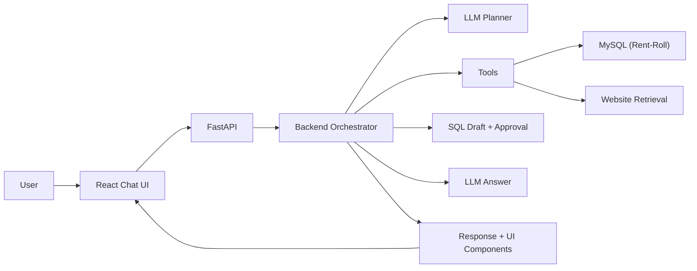

# Aker Property Assistant

Property-scoped AI chatbot prototype for answering questions about a selected Aker property, such as `115r`.

The assistant combines structured rent-roll data in MySQL with scraped public property website content. It supports runtime LLM switching, Markdown responses, streamed LLM output, property-scoped retrieval, and structured UI components such as KPI cards, charts, tables, and comparisons.

## Features

- Property-scoped chat by active `property_code`.
- Structured rent-roll analytics from MySQL.
- Unstructured website retrieval from scraped property pages.
- Hybrid retrieval using Chroma vector search, BM25 keyword search, and reciprocal rank fusion.
- Metadata filtering by `property_code` and optional page type.
- Runtime model switching through the UI and API.
- Markdown answers with source citations.
- Streamed responses for real LLM calls.
- Embedded UI components for KPIs, trends, charge breakdowns, vacant units, balances, and comparisons.
- SQL review workflow for LLM-drafted, read-only analytics queries that are not covered by prebuilt tools.
- Golden dataset and evaluation scripts for retrieval and answer quality.

## Project Structure

```text
app/                         FastAPI backend, orchestration, tools, retrieval clients
frontend/                    React/Vite chatbot UI
scripts/                     Data loading, scraping, ingestion, and eval runners
Data/                        Structured input/output data and retrieval indexes
config/property_sources.json Property website source map
evals/                       Golden datasets and evaluation reports
tests/                       Unit and integration-style tests
docs/                        More detailed implementation notes
```

## Setup

Prerequisites:

- Python 3.12+
- `uv`
- Node.js 20+
- Docker Desktop or Docker Engine

### Docker-First Local Setup

If you want the easiest local setup, use Docker for MySQL and run the backend/frontend on your machine.
You do not need to install a local MySQL server or the `mysql` command-line client for this path; the loader connects to the Docker database through the Python MySQL connector installed by `uv sync`.

1. Install Docker Desktop (macOS/Windows) or Docker Engine (Linux):

- macOS/Windows: https://www.docker.com/products/docker-desktop/
- Linux: https://docs.docker.com/engine/install/

2. Install `uv` (Python package manager):

```bash
brew install uv
```

Windows (PowerShell):

```powershell
winget install --id Astral.uv -e
```

If Python is already installed:

```bash
pip install uv
```

3. Open the project folder in a terminal:

```bash
cd /path/to/AKER_Chatbot
```

4. Create the `.env` file, then copy the example values:

```bash
touch .env
cp .env.example .env
```

5. Add any real model keys in .env you want to use:

```bash
ANTHROPIC_API_KEY=...
OPENAI_API_KEY=...
GROQ_API_KEY=...
```

6. Install Python dependencies:

```bash
uv sync
```

7. Start the MySQL container in new terminal:

```bash
docker compose up -d mysql
```

8. Wait for MySQL to be healthy, then load the structured rent-roll data:

```bash
uv run python scripts/load_rent_roll_mysql.py --reset
```

The loader reads the rent-roll Excel files in `Data/RentRoll_LeaseCharges_NamesRedacted copy/` and creates normalized MySQL tables keyed by `property_code`.

9. First-time setup only: scrape websites and build retrieval indexes:

```bash
uv run python scripts/scrape_property_sites.py
uv run python scripts/ingest_unstructured.py --reset
```

10. In a second terminal, start the backend:

```bash
uv run aker-api
```

11. In a third terminal, start the frontend:

```bash
cd frontend
npm install
npm run dev
```

12. Open the app in your browser:

```text
http://127.0.0.1:5173/
```

### Unstructured Data

New users should run the scraper and ingestion steps at least once before starting the app so website questions have data to search.

To re-scrape public property websites:

```bash
uv run python scripts/scrape_property_sites.py
```

To rebuild retrieval indexes:

```bash
uv run python scripts/ingest_unstructured.py --reset
```

To manually test scoped retrieval:

```bash
uv run python scripts/search_unstructured.py "EV charging bike storage" --property-code 115r --page-type amenities
```

Health check:

```bash
curl http://127.0.0.1:8000/health
```

## API Examples

Blocking chat response:

```bash
curl -X POST http://127.0.0.1:8000/chat \
  -H "Content-Type: application/json" \
  -d '{
    "property_code": "115r",
    "model": "anthropic:claude-haiku-4-5-20251001",
    "message": "What is the latest occupancy and market rent?"
  }'
```

Streaming chat response:

```bash
curl -N -X POST http://127.0.0.1:8000/chat/stream \
  -H "Content-Type: application/json" \
  -d '{
    "property_code": "115r",
    "model": "anthropic:claude-haiku-4-5-20251001",
    "message": "Give me a concise executive summary of this property."
  }'
```

## Architecture Overview

The system is organized as a scoped retrieval and orchestration pipeline.



1. The user selects a property in the React UI.
2. The frontend sends `property_code`, selected `model`, and the user message to FastAPI.
3. The backend runs a deterministic router (rules + local embeddings) and, for real models, an LLM planner that proposes a route (structured, retrieval, hybrid, clarification, unsupported) plus tool names.
4. Tool names are validated against the allowlist; property scoping is enforced server-side.
5. For structured analytics, the orchestrator checks a metric capability registry before tool execution.
6. Supported metrics are routed to bounded tools.
7. For unsupported structured metrics, the LLM may draft a read-only SQL query instead of guessing from partial data.
8. The backend validates SQL drafts before they reach the UI. The guard allows only a single `SELECT`, approved tables, explicit active-property filters for every referenced table, and a bounded `LIMIT`.
9. Valid SQL drafts are shown in the UI for user approval before execution.
10. Approved SQL is executed only after the user clicks the approval control.
11. Every structured SQL query is filtered by active `property_code`.
12. Every retrieval query is filtered by active `property_code` metadata.
13. Retrieval uses Chroma vector search plus BM25 keyword search, fused with reciprocal rank fusion.
14. Retrieved chunks are annotated with evidence confidence before being passed to the LLM.
15. The LLM receives scoped tool results, retrieval evidence, component JSON, and guardrails.
16. The API returns Markdown, sources, tool results, and structured UI component definitions.
17. The React UI renders the Markdown and component payloads as chat messages, KPI cards, charts, tables, comparisons, SQL approval cards, and source links.

## Design Decisions

MySQL was used for rent-roll data because the source files are structured and naturally relational. The schema separates property metadata, reports, summary groups, unit-level rows, and charge summaries. This makes analytical queries explicit, auditable, and property-scoped.

The public website content is treated as unstructured data and ingested into a retrieval layer. Chunks are created using HTML section-aware chunking so amenities, floorplans, fees, and page sections stay more coherent than arbitrary fixed-size chunks.

Hybrid retrieval was chosen over vector-only retrieval because property websites contain exact terms such as `EV charging`, `A07`, `bike storage`, and charge/floorplan labels. BM25 helps exact-match queries, while Chroma handles paraphrases. Reciprocal rank fusion combines both without adding a heavy search dependency.

The orchestrator does not let the LLM freely choose arbitrary tools. Instead, the backend routes intent and calls bounded tools itself. This keeps property scoping enforceable end-to-end and makes responses more predictable during a demo.

Structured analytics also pass through a lightweight capability registry. The registry documents which metric families are supported by complete, validated tools, such as latest KPIs, occupancy trend, top balances, vacant units, charge breakdown, and average market rent by unit type. If a user asks for an unsupported aggregate, such as average balance by bedroom category or median lease charges by unit type, the assistant does not compute it from a related partial result. It returns a limitation message and suggests supported views.

For real LLMs, unsupported structured metrics can also enter a controlled SQL review workflow. The LLM drafts a candidate read-only query, but the backend does not execute it immediately. The SQL must pass validation for single-statement `SELECT` syntax, approved table names, active-property filtering, and row limits. Only after the user approves it in the UI does the backend execute the query and render the result as a table.

The LLM is used for natural-language synthesis, not as the source of truth. Numeric facts come from MySQL tools, website facts come from retrieved chunks, and UI components are generated from structured tool outputs.

Streaming is implemented with server-sent events on `/chat/stream`. Real LLM token output appears progressively, and the final event includes complete Markdown, sources, and UI components.

## Property Scoping

Property scoping is enforced in multiple places:

- The frontend always sends an active `property_code`.
- MySQL repository methods include `WHERE property_code = %s`.
- Chroma and BM25 retrieval both filter by `property_code`.
- LangChain tools require `property_code` as an input.
- The orchestrator passes only active-property tool results to the LLM.
- If the user mentions another property while a different property is selected, the assistant adds an inline scope note and still answers only for the selected property.

## Supported Query Types

Examples the assistant is designed to handle:

- latest occupancy, market rent, lease charges, and vacant count
- executive summary
- occupancy trend over available months
- rent vs lease charge comparison
- charge category breakdown
- top balances
- vacant units and bedroom categories
- average market rent by bedroom category and floorplan code
- unsupported structured aggregates, such as average balance by bedroom category, are detected and answered with a limitation rather than partial calculations
- website amenities and apartment features
- EV charging, bike storage, parking, and other website-supported facts
- floorplans advertised on the website
- property location
- unavailable years, such as asking for 2024 when only 2025 data exists
- ambiguous short prompts, such as `charges`
- no-evidence website questions, such as reviews when reviews were not scraped

## Evaluations

Run the local test suite:

```bash
uv run pytest
```

Run the golden retrieval and generation dataset:

```bash
uv run python scripts/run_golden_evals.py --output-json evals/golden_report.json
```

Optional LLM-judged metrics:

```bash
uv run python scripts/run_llm_judge_evals.py --output-json evals/llm_judge_report.json
```

Evaluation coverage includes:

- property-scope isolation
- retrieval relevance
- retrieval precision@k
- MRR
- NDCG@k
- evidence recall
- answer faithfulness
- answer relevancy
- completeness
- citation quality
- deterministic routing and response behavior for supported queries

## Assumptions

- The provided rent-roll Excel files are the source of truth for structured property facts.
- The available structured data currently covers the loaded report months only.
- Public property websites are acceptable sources for unstructured content.
- The user selects one active property at runtime, and answers should stay scoped to that property.


## Tradeoffs

- Chroma is simple to run locally and good for a prototype, but it is not a managed production vector database.
- BM25 is stored locally with SQLite, which is lightweight but not designed for large multi-tenant search workloads.
- The included local retrieval indexes make demos faster, but they can also be rebuilt from source data.
- Intent routing uses local rules and embeddings for reliability. This is more predictable than fully agentic tool calling, but it means new query families may require adding examples or rules.
- The LLM is not given unrestricted tool access. This reduces risk but makes the orchestration layer more explicit.
- Structured analytics use curated SQL-backed tools for known metrics and a guarded SQL approval workflow for unsupported metrics. This improves safety, testability, and property scoping, but it is less automatic than unrestricted agentic SQL execution.
- The frontend renders a curated set of UI components rather than arbitrary LLM-generated HTML, which is safer but less flexible.

## Limitations

- Conversation memory is intentionally limited. The system handles many follow-ups, but it is not a full long-term conversational memory system.
- Website content is only as complete as the latest scrape.
- If a website hides data behind JavaScript or external APIs, the scraper may not capture every detail.
- Real LLM calls require valid API keys and available credits.
- The prototype is designed for local development, not production deployment.
- There is no authentication or multi-user authorization layer.
- MySQL must be running and loaded before structured-data questions will work.
- The assistant does not execute arbitrary database metrics automatically. Unsupported structured metrics can produce a proposed read-only SQL query, but the user must approve it before execution.
- The SQL approval guard is intentionally strict. Complex valid SQL may be rejected if it cannot prove every referenced table is explicitly scoped to the active property.
- The capability registry catches common unsupported aggregate patterns, but it is not a complete natural-language SQL planner. New metric families such as renewal trends, bad debt percentage, lease expirations, or move-in/move-out analytics would still benefit from new catalog entries and validated tools.
- If retrieval indexes are deleted, run `scripts/ingest_unstructured.py` again before testing website questions.

## Packaging Notes

Do not include local secrets in the final zip:

- exclude `.env`
- exclude `.venv/`
- exclude `frontend/node_modules/`
- exclude `frontend/dist/`
- exclude Python caches and test caches

Include `.env.example`, source code, scripts, docs, config, tests, eval files, and the representative data needed to reproduce the prototype.

## Additional Docs

- `docs/structured-data-load.md`
- `docs/unstructured-source-plan.md`
- `docs/retrieval-ingestion.md`
- `docs/langchain-orchestration.md`
- `docs/frontend-ui.md`
- `docs/evals.md`
