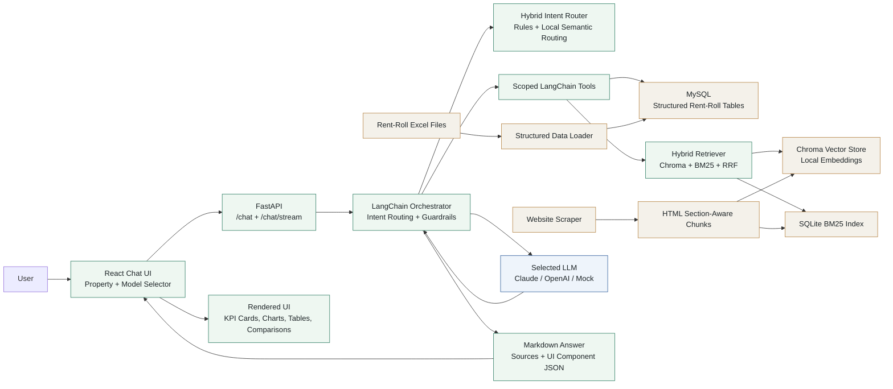

# Aker Property Assistant

Property-scoped AI chatbot prototype for answering questions about a selected Aker property, such as `115r`.

The assistant combines structured rent-roll data in MySQL with scraped public property website content. It supports runtime LLM switching, Markdown responses, streamed LLM output, property-scoped retrieval, and structured UI components such as KPI cards, charts, tables, and comparisons.

## Features

- Property-scoped chat by active `property_code`.
- Structured rent-roll analytics from MySQL.
- Unstructured website retrieval from scraped property pages.
- Hybrid retrieval using Chroma vector search, BM25 keyword search, and reciprocal rank fusion.
- Metadata filtering by `property_code` and optional page type.
- Runtime model switching through the UI and API.
- Markdown answers with source citations.
- Streamed responses for real LLM calls.
- Embedded UI components for KPIs, trends, charge breakdowns, vacant units, balances, and comparisons.
- Golden dataset and evaluation scripts for retrieval and answer quality.

## Project Structure

```text
app/                         FastAPI backend, orchestration, tools, retrieval clients
frontend/                    React/Vite chatbot UI
scripts/                     Data loading, scraping, ingestion, and eval runners
Data/                        Structured input/output data and retrieval indexes
config/property_sources.json Property website source map
evals/                       Golden datasets and evaluation reports
tests/                       Unit and integration-style tests
docs/                        More detailed implementation notes
```

## Setup

Prerequisites:

- Python 3.12+
- `uv`
- Node.js 20+
- Docker

Install Python dependencies:

```bash
uv sync
```

Create local environment config:

```bash
cp .env.example .env
```

Add any real model keys you want to use:

```bash
ANTHROPIC_API_KEY=...
OPENAI_API_KEY=...
GROQ_API_KEY=...
```

The mock model works without an API key and is useful for tests.

Start MySQL:

```bash
docker compose up -d mysql
```

Load structured rent-roll data into MySQL:

```bash
uv run python scripts/load_rent_roll_mysql.py --reset
```

The loader reads the rent-roll Excel files in `Data/RentRoll_LeaseCharges_NamesRedacted copy/` and creates normalized MySQL tables keyed by `property_code`.

## Unstructured Data

The scraped website data is already included under `Data/unstructured/`, and retrieval indexes are included under `Data/chroma/` and `Data/retrieval/`.

To re-scrape public property websites:

```bash
uv run python scripts/scrape_property_sites.py
```

To rebuild retrieval indexes:

```bash
uv run python scripts/ingest_unstructured.py --reset
```

To manually test scoped retrieval:

```bash
uv run python scripts/search_unstructured.py "EV charging bike storage" --property-code 115r --page-type amenities
```

## Run The App

Start the FastAPI backend:

```bash
uv run uvicorn app.main:app --host 127.0.0.1 --port 8000
```

Health check:

```bash
curl http://127.0.0.1:8000/health
```

Start the React UI:

```bash
cd frontend
npm install
npm run dev
```

Open:

```text
http://127.0.0.1:5173/
```

## API Examples

Blocking chat response:

```bash
curl -X POST http://127.0.0.1:8000/chat \
  -H "Content-Type: application/json" \
  -d '{
    "property_code": "115r",
    "model": "mock:mock-property-assistant",
    "message": "What is the latest occupancy and market rent?"
  }'
```

Streaming chat response:

```bash
curl -N -X POST http://127.0.0.1:8000/chat/stream \
  -H "Content-Type: application/json" \
  -d '{
    "property_code": "115r",
    "model": "anthropic:claude-haiku-4-5-20251001",
    "message": "Give me a concise executive summary of this property."
  }'
```

## Architecture Overview

The system is organized as a scoped retrieval and orchestration pipeline.



1. The user selects a property in the React UI.
2. The frontend sends `property_code`, selected `model`, and the user message to FastAPI.
3. The backend routes the query with a hybrid intent router:
   - deterministic rules for high-risk or common cases,
   - local semantic routing for paraphrases,
   - optional LLM fallback only when using a real LLM and local routing is uncertain.
4. The orchestrator calls only the tools needed for the routed intent.
5. Every structured SQL query is filtered by active `property_code`.
6. Every retrieval query is filtered by active `property_code` metadata.
7. Retrieval uses Chroma vector search plus BM25 keyword search, fused with reciprocal rank fusion.
8. Retrieved chunks are annotated with evidence confidence before being passed to the LLM.
9. The LLM receives scoped tool results, retrieval evidence, component JSON, and guardrails.
10. The API returns Markdown, sources, tool results, and structured UI component definitions.
11. The React UI renders the Markdown and component payloads as chat messages, KPI cards, charts, tables, and source links.

## Design Decisions

MySQL was used for rent-roll data because the source files are structured and naturally relational. The schema separates property metadata, reports, summary groups, unit-level rows, and charge summaries. This makes analytical queries explicit, auditable, and property-scoped.

The public website content is treated as unstructured data and ingested into a retrieval layer. Chunks are created using HTML section-aware chunking so amenities, floorplans, fees, and page sections stay more coherent than arbitrary fixed-size chunks.

Hybrid retrieval was chosen over vector-only retrieval because property websites contain exact terms such as `EV charging`, `A07`, `bike storage`, and charge/floorplan labels. BM25 helps exact-match queries, while Chroma handles paraphrases. Reciprocal rank fusion combines both without adding a heavy search dependency.

The orchestrator does not let the LLM freely choose arbitrary tools. Instead, the backend routes intent and calls bounded tools itself. This keeps property scoping enforceable end-to-end and makes responses more predictable during a demo.

The LLM is used for natural-language synthesis, not as the source of truth. Numeric facts come from MySQL tools, website facts come from retrieved chunks, and UI components are generated from structured tool outputs.

Streaming is implemented with server-sent events on `/chat/stream`. Real LLM token output appears progressively, and the final event includes complete Markdown, sources, and UI components.

## Property Scoping

Property scoping is enforced in multiple places:

- The frontend always sends an active `property_code`.
- MySQL repository methods include `WHERE property_code = %s`.
- Chroma and BM25 retrieval both filter by `property_code`.
- LangChain tools require `property_code` as an input.
- The orchestrator passes only active-property tool results to the LLM.
- If the user mentions another property while a different property is selected, the assistant adds an inline scope note and still answers only for the selected property.

## Supported Query Types

Examples the assistant is designed to handle:

- latest occupancy, market rent, lease charges, and vacant count
- executive summary
- occupancy trend over available months
- rent vs lease charge comparison
- charge category breakdown
- top balances
- vacant units and bedroom categories
- average market rent by bedroom category and floorplan code
- website amenities and apartment features
- EV charging, bike storage, parking, and other website-supported facts
- floorplans advertised on the website
- property location
- unavailable years, such as asking for 2024 when only 2025 data exists
- ambiguous short prompts, such as `charges`
- no-evidence website questions, such as reviews when reviews were not scraped

## Evaluations

Run the local test suite:

```bash
uv run pytest
```

Run the golden retrieval and generation dataset:

```bash
uv run python scripts/run_golden_evals.py --output-json evals/golden_report.json
```

Optional LLM-judged metrics:

```bash
uv run python scripts/run_llm_judge_evals.py --output-json evals/llm_judge_report.json
```

Evaluation coverage includes:

- property-scope isolation
- retrieval relevance
- retrieval precision@k
- MRR
- NDCG@k
- evidence recall
- answer faithfulness
- answer relevancy
- completeness
- citation quality
- deterministic chat behavior with the mock model

## Assumptions

- The provided rent-roll Excel files are the source of truth for structured property facts.
- The available structured data currently covers the loaded report months only.
- Public property websites are acceptable sources for unstructured content.
- A representative sample of website content is sufficient for the take-home prototype.
- The user selects one active property at runtime, and answers should stay scoped to that property.
- Local sentence-transformer embeddings are acceptable to avoid paid embedding APIs.

## Tradeoffs

- Chroma is simple to run locally and good for a prototype, but it is not a managed production vector database.
- BM25 is stored locally with SQLite, which is lightweight but not designed for large multi-tenant search workloads.
- The included local retrieval indexes make demos faster, but they can also be rebuilt from source data.
- Intent routing uses local rules and embeddings for reliability. This is more predictable than fully agentic tool calling, but it means new query families may require adding examples or rules.
- The LLM is not given unrestricted tool access. This reduces risk but makes the orchestration layer more explicit.
- Structured analytics use curated SQL-backed tools rather than free-form LLM-generated SQL. This improves safety, testability, and property scoping, but unsupported metrics require adding a new repository method/tool or a future validated metric catalog.
- The frontend renders a curated set of UI components rather than arbitrary LLM-generated HTML, which is safer but less flexible.

## Limitations

- Conversation memory is intentionally limited. The system handles many follow-ups, but it is not a full long-term conversational memory system.
- Website content is only as complete as the latest scrape.
- If a website hides data behind JavaScript or external APIs, the scraper may not capture every detail.
- Real LLM calls require valid API keys and available credits.
- The prototype is designed for local development, not production deployment.
- There is no authentication or multi-user authorization layer.
- MySQL must be running and loaded before structured-data questions will work.
- The assistant does not answer arbitrary database metrics automatically. It currently supports the implemented rent-roll analytics tools; questions outside those tools should be clarified or reported as unsupported rather than answered with generated SQL.
- If retrieval indexes are deleted, run `scripts/ingest_unstructured.py` again before testing website questions.

## Packaging Notes

Do not include local secrets in the final zip:

- exclude `.env`
- exclude `.venv/`
- exclude `frontend/node_modules/`
- exclude `frontend/dist/`
- exclude Python caches and test caches

Include `.env.example`, source code, scripts, docs, config, tests, eval files, and the representative data needed to reproduce the prototype.

## Additional Docs

- `docs/structured-data-load.md`
- `docs/unstructured-source-plan.md`
- `docs/retrieval-ingestion.md`
- `docs/langchain-orchestration.md`
- `docs/frontend-ui.md`
- `docs/evals.md`
