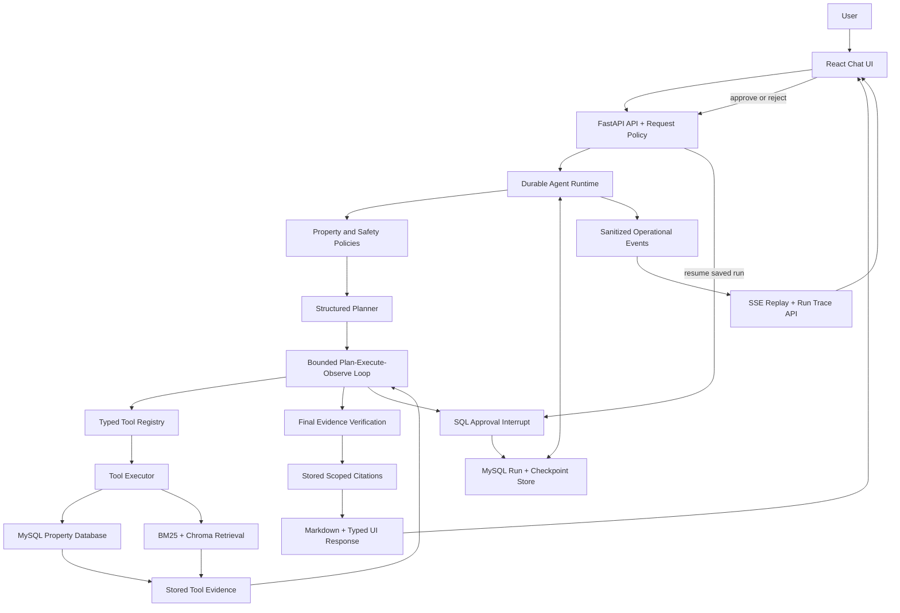
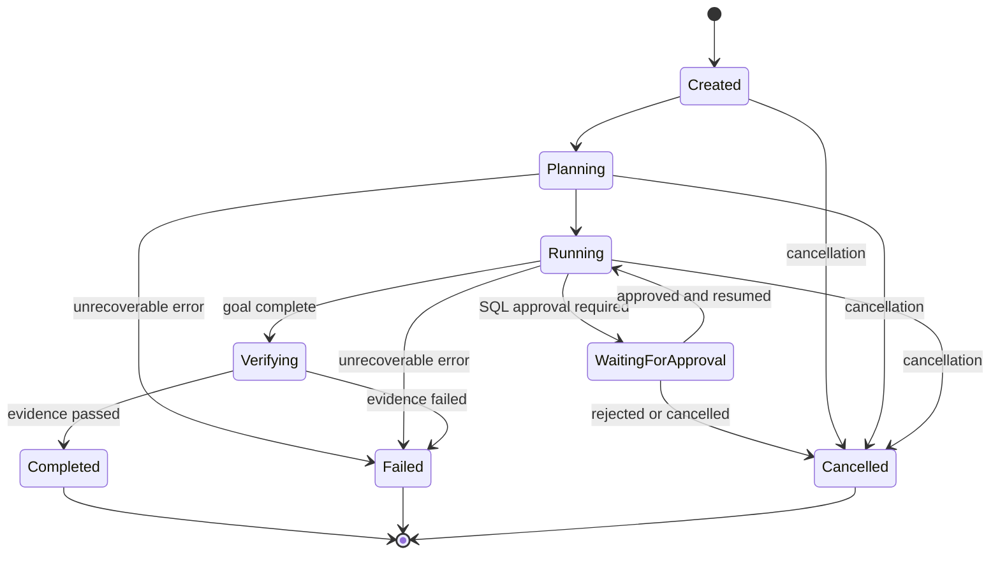

# Aker Property Assistant

Property-scoped AI chatbot prototype for answering questions about a selected Aker property, such as `115r`.

The assistant combines structured rent-roll data in MySQL with scraped public property website content. It supports runtime LLM switching, Markdown responses, streamed LLM output, property-scoped retrieval, and structured UI components such as KPI cards, charts, tables, and comparisons.

## Features

- Property-scoped chat by active `property_code`.
- Structured rent-roll analytics from MySQL.
- Unstructured website retrieval from scraped property pages.
- Hybrid retrieval using Chroma vector search, BM25 keyword search, and reciprocal rank fusion.
- Metadata filtering by `property_code` and optional page type.
- Runtime model switching through the UI and API.
- Markdown answers with source citations.
- Streamed responses for real LLM calls.
- Embedded UI components for KPIs, trends, charge breakdowns, vacant units, balances, and comparisons.
- LLM-assisted tool planning with backend validation and server-side `property_code` injection.
- Typed tool registry with validated inputs/outputs, bounded execution, retry policy, and budgets.
- Bounded plan-execute-observe-decide loop with configurable run limits.
- Adaptive occupancy-decline investigation with verified evidence and an executive brief.
- Durable conversation turns, rolling summaries, run state, artifacts, and evidence.
- Durable operational run events with scoped trace APIs, cancellation, and a Run Trace panel.
- Deterministic trajectory scoring and failure-injection reliability evaluations.
- Readiness checks, structured JSON logs/errors, request IDs, and a rate-limit hook.
- Reproducible backend container and GitHub Actions backend/frontend validation.
- Safe SQL approval workflow for custom structured rent-roll questions not covered by predefined tools.
- Golden dataset and evaluation scripts for retrieval and answer quality.

## Project Structure

```text
app/agents/                  Agent runtime, workflow, planner, state, and policies
app/memory/                  Durable conversation, run, artifact, and evidence stores
app/tools/                   Typed contracts, registry, executor, and property tools
app/core/                    Validated settings, structured logging/errors, HTTP policy hooks
app/                         FastAPI backend, services, tools, retrieval clients
frontend/                    React/Vite chatbot UI
scripts/                     Data loading, scraping, ingestion, and eval runners
Data/                        Structured input/output data and retrieval indexes
config/property_sources.json Property website source map
evals/                       Golden datasets and evaluation reports
sql/migrations/              Ordered MySQL agent-runtime migrations
.github/workflows/ci.yml     Backend lint/tests and frontend build validation
Dockerfile                   Reproducible FastAPI backend image
```

## Setup

Prerequisites:

- Python 3.12+
- `uv`
- Node.js 20.19+ or 22.12+
- Docker Desktop or Docker Engine

### Docker-First Local Setup

If you want the easiest local setup, use Docker for MySQL and run the backend/frontend on your machine.
You do not need to install a local MySQL server or the `mysql` command-line client for this path; the loader connects to the Docker database through the Python MySQL connector installed by `uv sync`.

1. Install Docker Desktop (macOS/Windows) or Docker Engine (Linux):

- macOS/Windows: https://www.docker.com/products/docker-desktop/
- Linux: https://docs.docker.com/engine/install/

2. Install `uv` (Python package manager):

macOS with Homebrew:

```bash
brew install uv
```

macOS/Linux without Homebrew:

```bash
curl -LsSf https://astral.sh/uv/install.sh | sh
```

Windows (PowerShell):

```powershell
winget install --id Astral.uv -e
```

Any OS, if Python/pip is already installed:

```bash
pip install uv
```

3. Open the project folder in a terminal:

```bash
cd /path/to/AKER_Chatbot
```

4. Create the `.env` file, then copy the example values:

```bash
touch .env
cp .env.example .env
```

5. Add any real model keys in .env you want to use:

```bash
ANTHROPIC_API_KEY=...
OPENAI_API_KEY=...
```

`GROQ_API_KEY` is used only by the optional LLM-judge evaluation, not by the chat
runtime.

For the smoothest demo with Claude Haiku, set:

```bash
DEFAULT_LLM_PROVIDER=anthropic
DEFAULT_LLM_MODEL=claude-haiku-4-5-20251001
```

6. Install Python dependencies:

```bash
uv sync
```

7. Start the MySQL container in new terminal:

```bash
docker compose up -d mysql
```

8. Wait for MySQL to be healthy, then load the structured rent-roll data:

```bash
uv run python scripts/load_rent_roll_mysql.py --reset
```

The loader reads the rent-roll Excel files in `Data/RentRoll_LeaseCharges_NamesRedacted copy/` and creates normalized MySQL tables keyed by `property_code`.

9. Apply the agent-runtime database migrations:

```bash
uv run python scripts/run_migrations.py
```

The migration runner is idempotent and records the checksum of every applied migration.

10. First-time setup only: scrape websites and build retrieval indexes:

```bash
uv run python scripts/scrape_property_sites.py
uv run python scripts/ingest_unstructured.py --reset
```

The first retrieval-ingestion run may download the local sentence-transformer embedding model into `Data/models/sentence-transformers`, so it needs internet access once.

11. In a second terminal, start the backend:

```bash
uv run aker-api
```

12. In a third terminal, start the frontend:

```bash
cd frontend
npm install
npm run dev
```

13. Open the app in your browser:

```text
http://127.0.0.1:5173/
```

### Unstructured Data

New users should run the scraper and ingestion steps at least once before starting the app so website questions have data to search.

To re-scrape public property websites:

```bash
uv run python scripts/scrape_property_sites.py
```

To rebuild retrieval indexes:

```bash
uv run python scripts/ingest_unstructured.py --reset
```

To refresh scraped website content and rebuild Chroma/BM25 in one command:

```bash
scripts/refresh_retrieval_indexes.sh
```

To run this automatically every day at 2:00 AM with cron:

```bash
crontab -e
```

Add this line, replacing the project path with your local path:

```cron
0 2 * * * cd /path/to/AKER_Chatbot && /path/to/AKER_Chatbot/scripts/refresh_retrieval_indexes.sh >> /path/to/AKER_Chatbot/logs/cron.log 2>&1
```

This keeps website retrieval fresh without scraping during user chat requests. Chat latency stays low because the chatbot still searches the prebuilt Chroma and BM25 indexes.

To manually test scoped retrieval:

```bash
uv run python scripts/search_unstructured.py "EV charging bike storage" --property-code 115r --page-type amenities
```

Health check:

```bash
curl http://127.0.0.1:8000/health
curl http://127.0.0.1:8000/ready
```

`/health` is a process liveness check. `/ready` verifies that MySQL accepts a bounded
readiness query and returns `503` when the dependency is unavailable.

To run MySQL and the containerized backend together after the structured data has been
loaded:

```bash
docker compose up --build mysql backend
```

The backend container applies pending migrations before starting. The local `Data/`
directory is mounted for the existing retrieval indexes.

### Local Command Reference

From the repository root, the complete local workflow is:

```bash
# Install backend and frontend dependencies.
uv sync
cd frontend && npm ci && cd ..

# Configure local settings on first setup, then add optional model API keys.
test -f .env || cp .env.example .env

# Start and initialize MySQL.
docker compose up -d mysql
uv run python scripts/load_rent_roll_mysql.py --reset
uv run python scripts/run_migrations.py

# Build retrieval data on first setup or after a refresh.
uv run python scripts/scrape_property_sites.py
uv run python scripts/ingest_unstructured.py --reset
```

Run the application in two terminals:

```bash
# Terminal 1: backend
uv run aker-api

# Terminal 2: frontend
cd frontend
npm run dev
```

Run deterministic validation without paid model calls:

```bash
uv run ruff check .
uv run python -m unittest discover -s tests
uv run python scripts/run_trajectory_evals.py \
  --output-json /tmp/aker-trajectory-report.json
uv run python scripts/run_golden_evals.py \
  --output-json /tmp/aker-golden-report.json
cd frontend && npm run build
```

The golden evaluation uses the local mock answer model and loaded property data. The
separate LLM-judge command is optional and is the only evaluation path that needs a
configured external model key.

Important settings are validated when the backend imports its configuration:

| Setting | Local default | Purpose |
| --- | --- | --- |
| `APP_ENV` | `local` | Selects `local`, `test`, `staging`, or `production` behavior |
| `APP_HOST` / `APP_PORT` | `127.0.0.1` / `8000` | Backend bind address |
| `APP_RELOAD` | `true` | Local reload; must be `false` in production |
| `MYSQL_*` | See `.env.example` | Database connection and bounded connect timeout |
| `DEFAULT_LLM_PROVIDER` / `DEFAULT_LLM_MODEL` | Anthropic / Claude Haiku | Default answer model |
| `EMBEDDING_PROVIDER` | `sentence_transformer` | Local semantic embedding implementation |
| `RUNTIME_USER_ID` | `local-user` | Trusted local user scope until authentication exists |
| `AGENT_MAX_*` | See `.env.example` | Step, tool, retry, approval, and duration limits |
| `STREAM_*` | See `.env.example` | SSE queue, polling, heartbeat, and cleanup bounds |

## API Examples

Blocking chat response:

```bash
curl -X POST http://127.0.0.1:8000/chat \
  -H "Content-Type: application/json" \
  -d '{
    "property_code": "115r",
    "model": "anthropic:claude-haiku-4-5-20251001",
    "message": "What is the latest occupancy and market rent?"
  }'
```

Streaming chat response:

```bash
curl -N -X POST http://127.0.0.1:8000/chat/stream \
  -H "Content-Type: application/json" \
  -d '{
    "property_code": "115r",
    "model": "anthropic:claude-haiku-4-5-20251001",
    "message": "Give me a concise executive summary of this property."
  }'
```

The first SSE event includes the backend-created `run_id`, conversation scope, and a
reconnect URL. Token events may then arrive progressively, followed by one complete
`final` event. To replay durable events after a connection interruption, reconnect with
the last received sequence number:

```bash
curl -N \
  -H "Last-Event-ID: 42" \
  "http://127.0.0.1:8000/api/agent-runs/RUN_ID/stream?property_code=115r&conversation_id=CONVERSATION_ID"
```

The replay stream returns only later persisted events and ends with `run_status` once
the run is completed, failed, or cancelled. The regular scoped run endpoint remains
available for retrieving the final status and answer after any disconnect.

Resume a checkpointed SQL approval using the `run_id` returned by chat:

```bash
curl -X POST http://127.0.0.1:8000/api/agent-runs/RUN_ID/approve \
  -H "Content-Type: application/json" \
  -d '{
    "property_code": "115r",
    "conversation_id": "CONVERSATION_ID",
    "approved": true
  }'
```

The approval endpoint reloads the saved checkpoint and executes the server-stored SQL
draft. SQL sent by the client is not accepted by this endpoint. The legacy
`POST /sql/execute` endpoint remains available for backward compatibility.

## Architecture Overview

The system is organized as a scoped retrieval and orchestration pipeline.


```mermaid
flowchart TD
  User["User"] --> UI["React Chat UI"]
  UI --> API["FastAPI API + Request Policy"]
  API --> Runtime["Durable Agent Runtime"]
  Runtime --> Policies["Property and Safety Policies"]
  Policies --> Planner["Structured Planner"]
  Planner --> Loop["Bounded Plan-Execute-Observe Loop"]
  Loop --> Registry["Typed Tool Registry"]
  Registry --> Executor["Tool Executor"]
  Executor --> PropertyDB["MySQL Property Database"]
  Executor --> Retrieval["BM25 + Chroma Retrieval"]
  PropertyDB --> Evidence["Stored Tool Evidence"]
  Retrieval --> Evidence
  Evidence --> Loop
  Loop --> Verification["Final Evidence Verification"]
  Verification --> Citations["Stored Scoped Citations"]
  Citations --> Response["Markdown + Typed UI Response"]
  Response --> UI

  Runtime <--> Checkpoints["MySQL Run + Checkpoint Store"]
  Loop --> Approval["SQL Approval Interrupt"]
  Approval --> Checkpoints
  UI -->|approve or reject| API
  API -->|resume saved run| Approval

  Runtime --> Events["Sanitized Operational Events"]
  Events --> EventStream["SSE Replay + Run Trace API"]
  EventStream --> UI
```

The primary execution path is User → FastAPI → Agent Runtime → Planner → Tool
Registry → Tool Executor → property database or retrieval → verification → citations.
Checkpoint persistence, SQL approval, and observability are side channels around that
path rather than model-controlled tools.

1. The user selects a property in the React UI.
2. The frontend sends `property_code`, selected `model`, and the user message to FastAPI.
3. The agent runtime creates a durable run scoped by backend-owned user identity, conversation, and active property. Each response includes `run_id` and `run_status`.
4. The backend loads the selected property profile and normalizes the active `property_code`.
5. The workflow creates `LLMToolPlanner`. The planner first applies deterministic guardrails for ambiguity, PII, unsafe SQL, unsupported external data, and cross-property requests.
6. For real LLM models, the planner can classify the request as `structured`, `retrieval`, `hybrid`, `sql_approval`, `unsupported`, or `clarification`.
7. Invalid planner output is retried within a fixed retry budget; if no valid plan is produced, the system falls back to deterministic planning.
8. Tool names are validated against an allowlist and identical planned actions are deduplicated; property scoping is injected server-side, never trusted from the LLM.
9. The bounded loop executes one tool action, validates and records its observation, then decides whether to continue. It stops on completion, approval, failure, repetition, or a configured limit.
10. Common structured analytics are routed to bounded SQL-backed tools such as latest KPIs, occupancy trend, charge breakdown, top balances, vacant units, rent by unit type, and rent vs lease charges.
11. Website questions are routed to property-scoped retrieval over scraped website chunks.
12. Custom structured metrics that are not covered by predefined tools can route to `sql_approval`.
13. In `sql_approval`, the LLM drafts a read-only SQL query with `:property_code`; it does not execute SQL.
14. The backend validates SQL drafts before they reach the UI. The guard checks allowed tables and columns, blocks PII, blocks unsafe operations, requires active-property scoping, rejects comments/semicolons/UNION, and requires row limits for row-level queries.
15. Valid SQL drafts are shown in the UI for user approval before execution.
16. Approved SQL is executed only through the backend approval endpoint, which binds the active `property_code` server-side.
17. Every structured SQL query is filtered by active `property_code`.
18. Every retrieval query is filtered by active `property_code` metadata.
19. Retrieval uses Chroma vector search plus BM25 keyword search, fused with reciprocal rank fusion.
20. Retrieved chunks are annotated with evidence confidence before being used in the answer.
21. The API returns Markdown, sources, tool results, and structured UI component definitions.
22. The React UI renders the Markdown and component payloads as chat messages, KPI cards, charts, tables, comparisons, SQL approval cards, source links, and an operational Run Trace panel.

### Agent Run Lifecycle


```mermaid
stateDiagram-v2
  [*] --> Created
  Created --> Planning
  Planning --> Running
  Running --> WaitingForApproval: SQL approval required
  WaitingForApproval --> Running: approved and resumed
  WaitingForApproval --> Cancelled: rejected or cancelled
  Running --> Verifying: goal complete
  Verifying --> Completed: evidence passed
  Planning --> Failed: unrecoverable error
  Running --> Failed: unrecoverable error
  Verifying --> Failed: evidence failed
  Created --> Cancelled: cancellation
  Planning --> Cancelled: cancellation
  Running --> Cancelled: cancellation
  Completed --> [*]
  Failed --> [*]
  Cancelled --> [*]
```

The successful approval path is **Created → Planning → Running → Waiting for Approval
→ Running → Verifying → Completed**. Runs that do not need SQL approval move directly
from Running to Verifying. Failed and Cancelled are terminal states alongside Completed.

The runtime appends an immutable checkpoint after run creation, plan creation, step
start/completion/failure, approval request/decision, SQL execution, verification, and
terminal completion or failure. Approval uses an atomic database claim, so duplicate
clicks cannot execute the same pending SQL twice. Checkpoint loading is scoped by the
backend-owned user identity, conversation, and active property.

### Reliability Guarantees

| Guarantee | Enforcement |
| --- | --- |
| Property isolation | The backend injects the active property into tool scope, SQL parameters, retrieval metadata filters, memory keys, checkpoints, events, artifacts, and citation reads. Cross-property requests and evidence are rejected. |
| Tool validation | Every registered tool has typed Pydantic input/output models, risk metadata, scope requirements, timeout, retry, idempotency, and output-size policy. The model cannot invent tools or trusted arguments. |
| SQL safety | Generated SQL is read-only, allowlisted, property-parameterized, row-bounded where required, and paused for explicit approval. The server executes only its checkpointed draft. |
| Retry policy | Only structured transient failures retry, using a fixed attempt bound with exponential backoff and jitter. Validation, policy, and permanent failures stop immediately. |
| Idempotency | Identical idempotent reads reuse a per-run result without consuming another tool-call budget. SQL approval uses an atomic database claim to prevent duplicate execution. |
| Execution limits | Configured step, tool-call, planner-retry, SQL-approval, total-duration, streaming-queue, and worker-backlog limits bound each run. Repeated identical actions are rejected. |
| Checkpoint recovery | State is saved after important transitions. Approval resume reloads the latest user/conversation/property-scoped checkpoint, so process memory is not the source of truth. |
| Citation verification | Numerical claims must exist in structured evidence; retrieval citations must resolve to stored chunks and hashes; citation IDs and property scope must match the run. |
| Operational privacy | Traces contain sanitized tool and status records, never hidden chain-of-thought, private prompts, raw API keys, or SQL text in application logs. |

### Runtime Observability

The runtime persists ordered operational events for run creation, planning, steps, tool
starts/successes/failures/retries, approvals, verification, cancellation, and terminal
completion or failure. Events include run, conversation, property, step, tool, attempt,
latency, timestamp, and structured error identifiers when applicable. Tool arguments and
outputs are reduced to sanitized operational details; private model reasoning fields are
removed before persistence.

Run inspection requires the same conversation and property scope used to create the run:

```bash
curl "http://127.0.0.1:8000/api/agent-runs/RUN_ID?property_code=115r&conversation_id=CONVERSATION_ID"
curl "http://127.0.0.1:8000/api/agent-runs/RUN_ID/steps?property_code=115r&conversation_id=CONVERSATION_ID"
curl "http://127.0.0.1:8000/api/agent-runs/RUN_ID/events?property_code=115r&conversation_id=CONVERSATION_ID"
curl "http://127.0.0.1:8000/api/agent-runs/RUN_ID/citations?property_code=115r&conversation_id=CONVERSATION_ID"
```

Cancel a nonterminal run with:

```bash
curl -X POST http://127.0.0.1:8000/api/agent-runs/RUN_ID/cancel \
  -H "Content-Type: application/json" \
  -d '{"property_code":"115r","conversation_id":"CONVERSATION_ID"}'
```

The frontend Run Trace panel shows planning, tool calls and retries, SQL approval,
verification, final state, and latency per step. It exposes operational records only,
never hidden chain-of-thought or private prompts.

### Operational API Contracts

Every HTTP response includes an `X-Request-ID`; a valid caller-provided value is
preserved for correlation. Application access, audit, readiness, and unexpected-error
records are emitted as JSON without request bodies, SQL text, API keys, or private model
reasoning. Error responses retain the `detail` field used by existing clients and add a
stable `error.code`, `error.message`, and `request_id` envelope.

Mutation endpoints call the replaceable rate-limit contract in
`app/core/rate_limit.py`. Local development uses the allow-all implementation; a real
deployment can assign a shared Redis or gateway-backed implementation to
`app.state.rate_limiter` without changing route logic. SQL approval decisions are also
stored as durable run events and emitted as sanitized audit logs.

### Citation Traceability

Successful structured and retrieval tool calls are normalized into stored citation
evidence and linked to the answer by stable citation IDs. Structured citations retain
the exact tool invocation, validated query parameters, source-data timestamp, and the
relevant returned values. Retrieval citations retain the document and chunk IDs, source
URL, content hash, retrieval timestamp, and index version when available.

Citation persistence rejects duplicate IDs, unsupported tool-invocation links,
cross-property evidence, altered content hashes, and retrieval records that do not match
their returned chunk. Investigation findings additionally verify that every cited ID
exists and every numerical metric occurs in its referenced structured evidence. The Run
Trace panel exposes the scoped citation metadata and evidence behind each answer.

### Tool Execution Guarantees

Every structured and retrieval tool is registered with a Pydantic input model, Pydantic
output model, risk level, timeout, retry limit, idempotency policy, required trusted
scopes, and maximum output size. The executor removes model-supplied trusted fields and
injects the backend-selected property and user scope. It enforces the per-run tool-call
budget, caches identical idempotent reads, records latency and operational trace events,
and retries only transient failures with exponential backoff and jitter. Permanent
errors and malformed outputs fail immediately with a structured error.

### Bounded Agent Loop

The workflow uses a plan-execute-observe-decide controller rather than handing an LLM
an unrestricted tool loop. Each decision can inspect sanitized observations from prior
steps, but it can select only one validated action at a time. Identical repeated actions
are rejected even when they use different plan labels. The controller and tool executor
jointly enforce these per-run settings:

| Environment variable | Default | Purpose |
| --- | ---: | --- |
| `AGENT_MAX_STEPS` | `8` | Maximum loop continuation steps |
| `AGENT_MAX_TOOL_CALLS` | `12` | Maximum tool executions across the run |
| `AGENT_MAX_PLANNER_RETRIES` | `2` | Retries after an invalid planner response |
| `AGENT_MAX_SQL_APPROVALS` | `1` | SQL approval interrupts allowed per run |
| `AGENT_MAX_RUN_SECONDS` | `60` | Total wall-clock execution bound |

The durable run checkpoint stores the sanitized action plan, observations, planner
attempt count, SQL approval count, and actual tool-call count. It does not store or
expose private model reasoning.

### Occupancy Decline Investigation

Requests such as “Investigate why occupancy declined during the last 12 months and
produce an executive brief” use a dedicated observation-driven workflow. It first loads
the occupancy series and calculates the largest consecutive decline. Only when a decline
exists does it fetch vacancies and rent by unit type for that exact report month, then
retrieve property-scoped public leasing context. A no-decline result stops after the
first tool instead of making unnecessary calls.

The response includes an `investigation` object with `run_id`, `status`, `summary`,
typed findings, citations, a Markdown artifact, and a trace summary. Every numerical
metric must exist in its referenced structured evidence, every retrieval citation must
reference a real scoped chunk, and cross-property citations are rejected. The brief
describes concurrent conditions but does not claim that correlation proves causation.

### Durable Conversation Memory

Conversation history is persisted in MySQL instead of application-process memory. Each
thread and turn is constrained by the trusted runtime user, client conversation id, and
active property code; each agent-backed turn also records its run id. The assistant sends
only the eight most recent turns plus a bounded rolling summary of older turns into the
next prompt.

Run memory retains the current plan, completed and pending steps, approval state,
failures, and execution budgets. Generated SQL proposals, reports, structured UI and
tool outputs, retrieved evidence, citations, and exported-file metadata are normalized
into run-linked artifact and evidence tables. Artifact and evidence reads join back
through the user, conversation, property, and optional run scope to prevent leakage.

Run the local mock-model demo with:

```bash
curl -s http://localhost:8000/chat \
  -H 'Content-Type: application/json' \
  -d '{
    "property_code": "115r",
    "model": "mock:demo",
    "conversation_id": "occupancy-demo",
    "message": "Investigate why occupancy declined during the last 12 months and produce an executive brief with supporting evidence."
  }'
```

## Engineering Decisions and Trade-offs

These are the main interview-level design choices, including what each choice gives up:

| Decision | Why | Trade-off |
| --- | --- | --- |
| Use a bounded agent instead of a fully autonomous loop | Fixed budgets, typed actions, deterministic stop rules, and evidence verification make execution explainable and testable. | New task families may require a policy, tool, or planner example instead of emerging automatically. |
| Inject trusted scope server-side | Property, user, database, and approval scope cannot safely come from model output or client-supplied tool arguments. | The backend owns more orchestration code and every new trusted dimension must be threaded through contracts. |
| Persist checkpoints | A run can survive process restart, pause for human approval, expose status after disconnect, and produce an audit trail. | Each transition performs additional database writes and state-schema evolution must remain backward compatible. |
| Require human approval for generated SQL | Validation plus approval limits data access and makes custom analytics auditable. | Custom questions take an extra interaction and the intentionally strict validator can reject complex but valid SQL. |
| Type tool inputs and outputs | Validation catches malformed model arguments and tool responses at a clear boundary before bad data reaches synthesis. | Tool schemas add maintenance work when repository outputs evolve. |
| Retry transient failures only | Temporary database or network failures can recover without repeating permanent policy, validation, or malformed-output failures. | Error classification must be maintained carefully; an incorrectly classified failure may stop early or retry unnecessarily. |
| Expose operational traces, not chain-of-thought | Run status, sanitized arguments, evidence, latency, and errors are enough to debug behavior without storing private reasoning. | Traces explain what executed and why at a policy level, but intentionally do not reveal hidden model deliberation. |
| Retain the existing hybrid retrieval system | BM25 preserves exact property terms while Chroma handles paraphrases; reciprocal-rank fusion already works locally and has evaluation coverage. | The local stores are appropriate for this project scale, not a substitute for managed multi-tenant retrieval infrastructure. |

MySQL was used for rent-roll data because the source files are structured and naturally relational. The schema separates property metadata, reports, summary groups, unit-level rows, and charge summaries. This makes analytical queries explicit, auditable, and property-scoped.

The public website content is treated as unstructured data and ingested into a retrieval layer. Chunks are created using HTML section-aware chunking so amenities, floorplans, fees, and page sections stay more coherent than arbitrary fixed-size chunks.

Hybrid retrieval was chosen over vector-only retrieval because property websites contain exact terms such as `EV charging`, `A07`, `bike storage`, and charge/floorplan labels. BM25 helps exact-match queries, while Chroma handles paraphrases. Reciprocal rank fusion combines both without adding a heavy search dependency.

The orchestrator does not let the LLM execute arbitrary actions. The LLM can help plan the route and draft SQL for approval, but the backend validates the plan, validates tool names, injects property scope, and controls execution.

Structured analytics first use predefined SQL-backed tools for common metrics, such as latest KPIs, occupancy trend, top balances, vacant units, charge breakdown, and average market rent by unit type. These are preferred because they are tested and scoped by design.

For custom structured metrics, the planner can route to a controlled SQL approval workflow. The LLM drafts a candidate read-only query with a `:property_code` placeholder, but the backend does not execute it immediately. The draft must pass validation for approved tables and columns, active-property filtering, no PII fields, no unsafe operations, and row limits. Only after approval does the backend bind the active property code and execute the query.

The LLM is used for natural-language synthesis, not as the source of truth. Numeric facts come from MySQL tools, website facts come from retrieved chunks, and UI components are generated from structured tool outputs.

Streaming is implemented with server-sent events on `/chat/stream`. Each response uses
a bounded token queue and a shared bounded worker pool, so slow clients cannot grow a
per-request queue or create a new background thread. The server detects closed clients,
propagates cooperative cancellation through the runtime and tool boundaries, and
persists the cancelled run state. Real LLM token output appears progressively, and the
final event includes complete Markdown, sources, and UI components.

Ordered run events are durable. `GET /api/agent-runs/{run_id}/stream` accepts either
`after_sequence` or the SSE `Last-Event-ID` header to replay missed events, optionally
follow the live run, and return its terminal status. The standard scoped run endpoint
also returns the final answer after the original streaming connection is gone.

## Property Scoping

Property scoping is enforced in multiple places:

- The frontend always sends an active `property_code`.
- MySQL repository methods include `WHERE property_code = %s`.
- Chroma and BM25 retrieval both filter by `property_code`.
- LangChain tools require `property_code` as an input.
- The orchestrator passes only active-property tool results to the LLM.
- LLM-drafted SQL must use `:property_code`; the backend binds the active property code only after approval.
- Cross-property or all-property requests are blocked before tool execution.
- If the user mentions another property while a different property is selected, the assistant adds an inline scope note and still answers only for the selected property.

## Supported Query Types

Examples the assistant is designed to handle:

- latest occupancy, market rent, lease charges, and vacant count
- executive summary
- occupancy trend over available months
- executive occupancy-decline investigation with period-specific vacancy evidence
- rent vs lease charge comparison
- charge category breakdown
- top balances
- vacant units and bedroom categories
- average market rent by bedroom category and floorplan code
- custom structured SQL approval questions, such as lowest market rents, unit counts by unit type, or total market rent by unit type
- website amenities and apartment features
- EV charging, bike storage, parking, and other website-supported facts
- floorplans advertised on the website
- property location
- unavailable years, such as asking for 2024 when only 2025 data exists
- ambiguous short prompts, such as `charges`
- no-evidence website questions, such as reviews when reviews were not scraped

## Evaluations

Run the golden retrieval and generation dataset:

```bash
uv run python scripts/run_golden_evals.py --output-json evals/golden_report.json
```

Run the deterministic agent trajectory dataset. This uses the real bounded loop,
occupancy policy, report builder, and citation verifier with injected local evidence;
it does not call an LLM or database:

```bash
uv run python scripts/run_trajectory_evals.py \
  --output-json /tmp/aker-trajectory-report.json
```

Run all reliability and failure-injection tests:

```bash
uv run python -m unittest discover -s tests
```

Optional LLM-judged metrics:

```bash
uv run python scripts/run_llm_judge_evals.py --output-json evals/llm_judge_report.json
```

The LLM-judged suite is optional and requires the configured external API key. A live
answer model can be sampled explicitly with `--answer-model "$LIVE_ANSWER_MODEL"`; it
is never part of the normal automated test suite.

Evaluation coverage includes:

- property-scope isolation
- retrieval relevance
- retrieval precision@k
- MRR
- NDCG@k
- evidence recall
- answer faithfulness
- answer relevancy
- completeness
- citation quality
- planner routing and response behavior for supported, unsupported, hybrid, and SQL approval queries
- correct tool selection and exact tool order
- unnecessary-call detection and execution-limit enforcement
- property scope, SQL approval, and citation-grounding checks
- tool timeout, malformed output, temporary database failure, and retry exhaustion
- empty retrieval, invalid model arguments, and duplicate completion handling
- restart-safe SQL approval, cross-property rejection, and missing citation evidence

## Assumptions

- The provided rent-roll Excel files are the source of truth for structured property facts.
- The available structured data currently covers the loaded report months only.
- Public property websites are acceptable sources for unstructured content.
- The user selects one active property at runtime, and answers should stay scoped to that property.


## Additional Trade-offs

- Chroma is simple to run locally and good for a prototype, but it is not a managed production vector database.
- BM25 is stored locally with SQLite, which is lightweight but not designed for large multi-tenant search workloads.
- The included local retrieval indexes make demos faster, but they can also be rebuilt from source data.
- Intent routing uses deterministic guardrails plus an LLM planner. This is safer than fully agentic tool calling, but new query families may still require examples, planner rules, or new predefined tools.
- The LLM is not given unrestricted tool access. This reduces risk but makes the orchestration layer more explicit.
- Structured analytics use curated SQL-backed tools for known metrics and a guarded SQL approval workflow for custom metrics. This improves safety, testability, and property scoping, but it is less automatic than unrestricted agentic SQL execution.
- The frontend renders a curated set of UI components rather than arbitrary LLM-generated HTML, which is safer but less flexible.

## Limitations

- Website content is only as complete as the latest scrape.
- If a website hides data behind JavaScript or external APIs, the scraper may not capture every detail.
- Real LLM calls require valid API keys and available credits.
- The prototype is designed for local development, not production deployment.
- There is no authentication or multi-user authorization layer.
- MySQL must be running and loaded before structured-data questions will work.
- The assistant does not execute custom database metrics automatically. Custom structured metrics can produce a proposed read-only SQL query, but the user must approve it before execution.
- The SQL approval guard is intentionally strict. Complex valid SQL may be rejected if it cannot prove every referenced table is scoped to the active property or if it references columns outside the allowlist.
- The SQL approval route improves flexibility, but production-grade analytics would still benefit from a formal metric catalog and more validated tools for metric families such as renewal trends, bad debt percentage, lease expirations, or move-in/move-out analytics.
- If retrieval indexes are deleted, run `scripts/ingest_unstructured.py` again before testing website questions.

## Future Improvements

- Add a formal metric catalog that defines supported business metrics, required tables, calculation rules, SQL templates, freshness requirements, and whether each metric is safe to expose.
- Expand validated analytics tools for common property-management questions such as renewal trends, bad debt percentage, delinquency aging, lease expirations, move-ins, move-outs, and rent growth.
- Move custom SQL from free-form draft approval toward approved parameterized query templates generated from the metric catalog.
- Add richer semantic summarization and user-controlled conversation retention policies.
- Add scheduled website re-scraping and index refresh jobs so retrieval content stays current.
- Add stronger retrieval evaluation with larger golden datasets, human labels, and periodic LLM-judge scoring for faithfulness, answer relevance, and citation quality.
- Add authentication and role-based access control, then forward the existing approval
  audit records to tamper-resistant centralized retention before using sensitive data.
- Move Chroma/BM25 to production-ready managed retrieval infrastructure if the number of properties or users grows.
